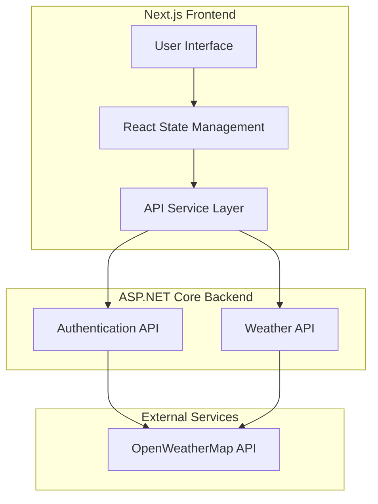
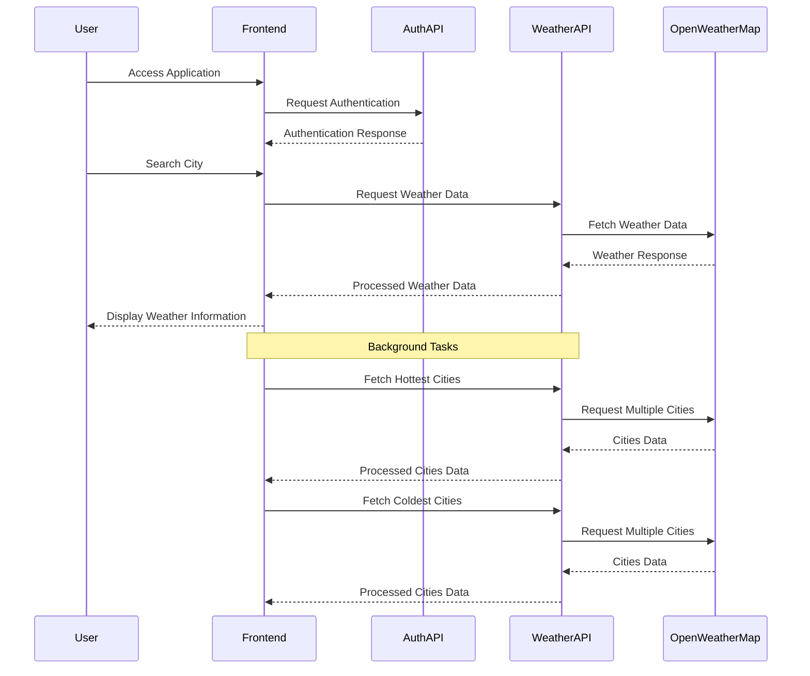
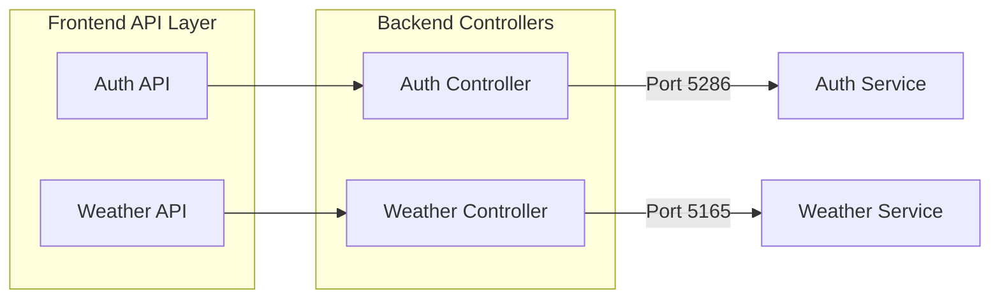

# Weather Application

A modern, full-stack weather application that provides real-time weather data for cities worldwide, featuring a beautiful UI and comprehensive weather information.


## Architecture Overview



## Data Flow



## API Structure



## Features

- Real-time weather data for any city worldwide
- Display of hottest and coldest cities
- Detailed weather information including:
  - Temperature
  - Feels like temperature
  - Humidity
  - Wind speed
  - Weather description
- Responsive design with Material-UI
- Client-side state management
- Error handling and loading states

## Technical Stack

### Frontend
- Next.js
- React
- Material-UI
- TypeScript
- React Hooks

### Backend
- ASP.NET Core Web API
- C#
- OpenWeatherMap API Integration
- CORS Support

### Development Tools
- TypeScript
- ESLint
- Prettier
- Git

## Getting Started

1. Clone the repository
2. Install dependencies:
   ```bash
   # Frontend
   cd 1000
   npm install

   # Backend
   cd 1000.API
   dotnet restore
   ```

3. Set up environment variables:
   - Create `.env.local` in the frontend directory
   - Add OpenWeatherMap API key to backend configuration

4. Run the application:
   ```bash
   # Frontend
   npm run dev

   # Backend
   dotnet run
   ```

## API Endpoints

### Authentication API (Port 5286)
- POST `/api/auth/login`
- POST `/api/auth/register`

### Weather API (Port 5165)
- GET `/api/Weather/city/{cityName}`
- GET `/api/Weather/hottest`
- GET `/api/Weather/coldest`

## Contributing

1. Fork the repository
2. Create your feature branch
3. Commit your changes
4. Push to the branch
5. Create a new Pull Request
